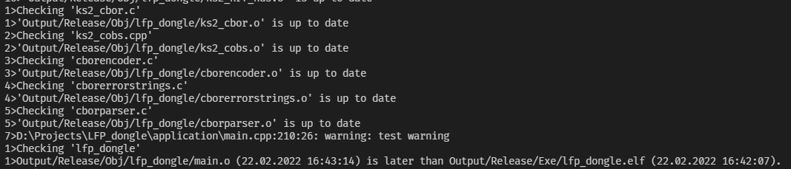
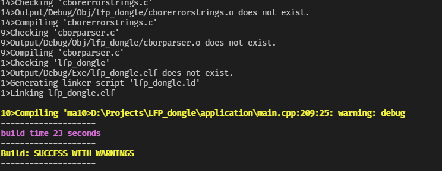

# README

Coloring stdout from the Segger emBuild tool.

Before                     |         After
:-------------------------:|:-------------------------:
     |  

Example
```bash
python3 -m embuild_colorize --command emBuild -config "Debug" -project "YOUR_PROJECT" "./SES/YOUR_PROJECT.emProject" -verbose
```
